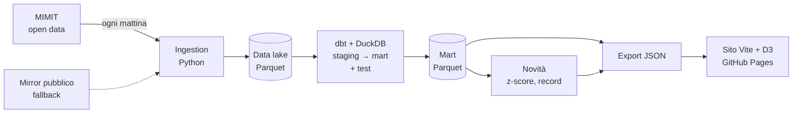

# Termometro Italia

**Il polso dell'Italia, misurato ogni giorno con dati aperti.**

Termometro Italia è un osservatorio automatico sui temi caldi dell'attualità italiana. Ogni mattina una pipeline raccoglie i dati pubblici, li verifica con test automatici e aggiorna un sito di cruscotti interattivi.

🔗 **Sito:** https://gabrieleafferni.github.io/termometroitalia/

| Termometro | Fonte | Stato |
|---|---|---|
| ⛽ Carburanti: prezzi di benzina, gasolio, GPL e metano in ~20.000 distributori | MIMIT, Osservaprezzi Carburanti | **attivo** |
| 💶 Salari reali: retribuzioni contrattuali contro inflazione | ISTAT (API SDMX) | in costruzione |
| 🚢 Immigrazione: sbarchi e accoglienza | Viminale, cruscotto giornaliero | in costruzione |
| 🗳️ Verso le elezioni: sondaggi e attività parlamentare | sondaggipoliticoelettorali.it, dati.camera.it | in costruzione |

---

## Architettura



Tutto gira su **GitHub Actions** (`.github/workflows/aggiornamento.yml`), due volte al giorno, senza server né costi.

| Livello | Cosa fa | Dove |
|---|---|---|
| **Ingestion** | Scarica i CSV del MIMIT, li valida e li archivia in Parquet immutabili (uno per data di estrazione). Idempotente, con retry e fallback su un mirror pubblico. | `pipeline/carburanti/ingest.py` |
| **Data lake** | Prezzi: uno snapshot completo al giorno. Anagrafica impianti: *change log* SCD tipo 2 (solo nuovi, modificati, chiusi), perché cambia di poche righe al giorno. | `data/raw/` |
| **Trasformazione** | Progetto dbt su DuckDB: staging → intermediate → mart, con i mart materializzati come Parquet (`external`). | `transform/` |
| **Qualità** | 29 test dbt: unicità, valori ammessi, intervalli plausibili, copertura minima del giorno, province mappate. Se un test fallisce, il sito non viene aggiornato. | `transform/models/schema.yml`, `transform/tests/` |
| **Novità** | Confronta l'ultimo giorno con la storia: variazioni a 7 e 30 giorni, record sulla finestra, strisce di rialzi o ribassi, scatti insoliti (z-score > 2,5). | `pipeline/insights.py` |
| **Sito** | Vite + D3, senza framework. Mappa canvas di 20.000 punti con zoom e hover, grafici SVG, vista tabellare per l'accessibilità. | `site/` |

## I dati prodotti

I mart in `data/marts/` sono versionati e riutilizzabili:

| Mart | Grana |
|---|---|
| `mart_carburanti__nazionale_giornaliero` | giorno × carburante × modalità (media, mediana, p10–p90) |
| `mart_carburanti__regionale_giornaliero` | giorno × regione × carburante, con scarto dalla media italiana |
| `mart_carburanti__provinciale_giornaliero` | giorno × provincia × carburante |
| `mart_carburanti__tipo_impianto_giornaliero` | giorno × strada/autostrada × carburante |
| `mart_carburanti__impianti_oggi` | un distributore per riga (ultimo giorno, con confronto a 7 giorni) |
| `mart_carburanti__bandiere_oggi` | marchio × carburante |
| `novita.json` | le notizie del giorno, ordinate per rilevanza |

La metodologia (prezzi di riferimento self/servito, finestra di validità di 8 giorni, filtro degli errori grossolani) è descritta nella pagina [Metodo](https://gabrieleafferni.github.io/termometroitalia/metodo.html).

## Eseguire in locale

```bash
# Python 3.11+ e Node 20+
pip install -r requirements.txt

python -m pipeline.carburanti.ingest                       # dati di oggi
python -m pipeline.carburanti.ingest --backfill-from 2026-07-28 --source mirror   # storico
(cd transform && dbt build --profiles-dir .)               # modelli + test
python -m pipeline.insights                                # novità
python -m pipeline.export_site                             # JSON per il sito

cd site && npm install && npm run dev                      # http://localhost:5173
```

## Struttura

```
pipeline/          ingestion, novità, export per il sito (Python)
transform/         progetto dbt (DuckDB): modelli, seed province, test
data/raw/          data lake Parquet (prezzi giornalieri, change log impianti)
data/marts/        tabelle finali Parquet + novita.json
site/              sito statico (Vite + D3)
.github/workflows/ automazione quotidiana e deploy su GitHub Pages
```

## Fonti e licenze dei dati

- Prezzi e anagrafica carburanti: **MIMIT – Osservaprezzi Carburanti**, licenza IODL 2.0. Storico dal 28/07/2026 ricostruito dall'archivio pubblico [LucaDDDD/benzina-data](https://github.com/LucaDDDD/benzina-data).
- Confini amministrativi: **ISTAT**, via [openpolis/geojson-italy](https://github.com/openpolis/geojson-italy) (CC-BY).

---

Un progetto di **Gabriele Afferni**, MSc Statistica e Finanza Quantitativa, Università di Torino.
